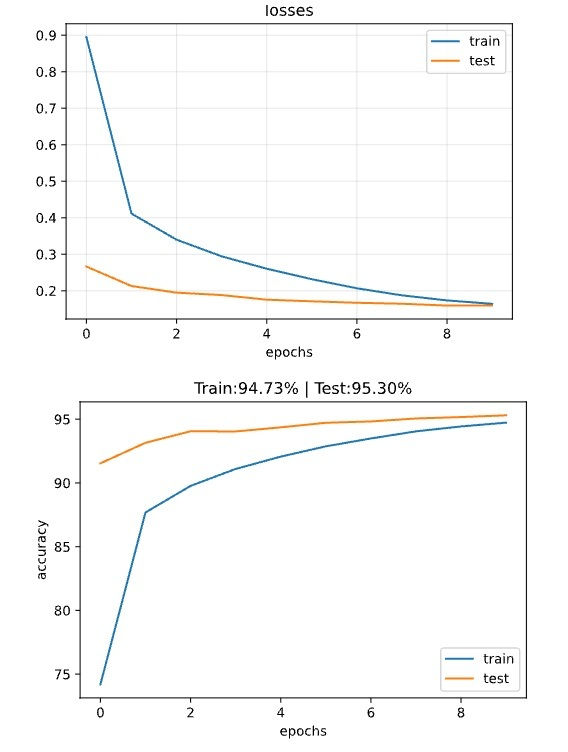
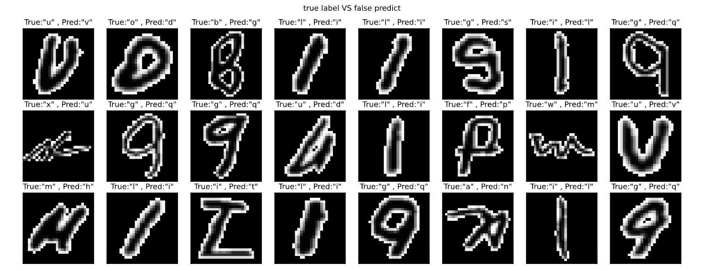

# 🔤 EMNIST Letters Classification using PyTorch CNN

> **Deep Learning • Computer Vision • PyTorch • CNN • Data Augmentation • Model Optimization**

<p align="center">


</p>

---

# ⭐ Project Highlights

- Built a complete handwritten character recognition pipeline using **PyTorch**
- Designed a **fully modular deep learning project** (no notebook-only workflow)
- Implemented a configurable CNN architecture supporting:
  - Flexible network architecture
  - Optimizers
  - Learning-rate schedulers
  - Data augmentation
- Conducted systematic experiments to optimize model performance
- Achieved **95.30% Test Accuracy** on the EMNIST Letters dataset
- Performed detailed error analysis to identify common character confusions

---

# 📌 Project Overview

This project focuses on recognizing handwritten English letters using a custom Convolutional Neural Network (CNN).

Rather than training a single model, the project was designed as a reusable deep learning framework that makes experimentation easy. Every stage of the pipeline is separated into independent modules, allowing different architectures, optimizers, schedulers, and augmentation techniques to be tested with minimal code changes.

The project emphasizes **clean software design**, **reproducibility**, and **systematic experimentation**, making it suitable as a portfolio project for computer vision and deep learning roles.

---

# 📂 Dataset

## EMNIST Letters Dataset

The model was trained on the **EMNIST Letters** dataset.

| Property | Value |
|----------|------:|
| Classes | 26 (A–Z) |
| Image Type | Grayscale |
| Image Size | 28 × 28 |
| Samples | 145,600 |
| Task | Multi-class Classification |

Dataset source:

https://www.nist.gov/itl/products-and-services/emnist-dataset

---

# 🏗 Project Structure

```text
EMNIST/
│
├── README.md
├── main.py
├── data.py
├── model.py
├── train_model.py
├── evaluate.py
├── Architecture_Model.py
├── augmentate.py
│
├── EMNIST_CNN_Experiments.ipynb
├── requirements.txt
│
└── images/
```

---

# 🔄 Training Pipeline

```text
Load Dataset
      │
      ▼
Custom PyTorch Dataset
      │
      ▼
Data Augmentation
      │
      ▼
CNN Model
      │
      ▼
Optimizer
      │
      ▼
Learning Rate Scheduler
      │
      ▼
Training
      │
      ▼
Evaluation
      │
      ▼
Error Analysis
```

---

# 🧠 CNN Architecture

The final network consists of **three convolutional blocks** followed by two fully connected layers.

```text
Input
(1 × 28 × 28)

        │
        ▼

Conv2D
BatchNorm
LeakyReLU
Dropout2D
MaxPooling

        │
        ▼

Conv2D
BatchNorm
LeakyReLU
Dropout2D
MaxPooling

        │
        ▼

Conv2D
BatchNorm
LeakyReLU
Dropout2D
MaxPooling

        │
        ▼

Flatten

        │
        ▼

Fully Connected

        │
        ▼

Fully Connected

        │
        ▼

Output (26 Classes)
```

---

# ⚙️ Best Model Configuration

| Parameter | Value |
|-----------|------:|
| Conv Channels | (64, 128, 256) |
| Kernel Size | 7 × 7 |
| Padding | 3 |
| Activation | LeakyReLU |
| Batch Normalization | ✔ |
| Dropout2D | 0.10 |
| FC Dropout | 0.40 |
| Hidden Units | (128, 64) |
| Loss Function | CrossEntropyLoss |

---

# 🚀 Training Configuration

| Parameter | Value |
|-----------|------:|
| Optimizer | AdamW |
| Weight Decay | 1e-4 |
| Scheduler | CosineAnnealingLR |
| Epochs | 10 |
| Batch Size | 64 |

---

# 🧪 Experiments

Multiple experiments were performed to understand how different components affect performance.

| Experiment | Test Accuracy |
|------------|--------------:|
| Baseline CNN | 93.46% |
| + BatchNorm & Dropout | 94.52% |
| + AdamW | 94.50% |
| + StepLR | 94.68% |
| + CosineAnnealingLR | 94.87% |
| Kernel Size = 5 | 95.06% |
| Kernel Size = 7 | 95.14% |
| + OneCycleLR | 94.99% |
| + RandomRotation (10°) | **95.30%** |
| + RandomAffine | 95.00% |
| Rotation + RandomErasing | 94.88% |
| Affine + RandomErasing | 95.07% |

---

# 🏆 Final Performance

**Best Test Accuracy**

> **95.30%**

Final configuration:

- CNN
- Batch Normalization
- Dropout
- AdamW
- CosineAnnealingLR
- RandomRotation (10°)

---

# 📊 Model Evaluation

The trained model was evaluated using several complementary metrics and visualizations.

Evaluation includes:

- Training & Validation Loss
- Training & Validation Accuracy
- Classification Report
- Precision / Recall / F1-score
- Normalized Confusion Matrix
- Misclassified Samples
- Error Frequency Analysis

---

## 📉 Training Curves



---

## 📄 Classification Report


---

## 📊 Confusion Matrix


---

## ❌ Misclassified Samples



---

# 🔍 Error Analysis

The most frequent mistakes occur between visually similar handwritten letters.

| True | Predicted | Count |
|------|-----------|------:|
| l | i | 101 |
| i | l | 78 |
| g | q | 70 |
| q | g | 15 |
| v | u | 15 |
| u | v | 12 |
| j | i | 10 |
| i | j | 9 |

These errors are expected because many handwritten letters share highly similar visual structures.

---

# 🛠 Technologies

### Programming

- Python

### Deep Learning

- PyTorch
- TorchVision
- CNN
- Batch Normalization
- Dropout
- Data Augmentation
- Learning Rate Scheduling

### Data Processing

- NumPy
- Matplotlib

### Evaluation

- Scikit-Learn

### Development

- VS Code
- Jupyter Notebook
- Git

---

# 📌 Key Features of This Project

- Modular project structure
- Custom PyTorch Dataset
- Configurable CNN architecture
- Configurable optimizer and scheduler
- Easy augmentation pipeline
- Experiment-friendly design
- Comprehensive evaluation utilities
- Misclassification analysis

---

# 🚀 Future Improvements

Possible future extensions include:

- ResNet-based models
- EfficientNet
- Vision Transformer (ViT)
- MixUp / CutMix
- Label Smoothing
- Early Stopping
- Mixed Precision Training
- Optuna Hyperparameter Optimization
- MLflow Experiment Tracking
- FastAPI Inference API
- Docker Deployment

---

# 📫 Contact

**Ziba Hatamian**

GitHub:

https://github.com/zziibbaa

---

⭐ If you found this project useful, consider giving the repository a star.
