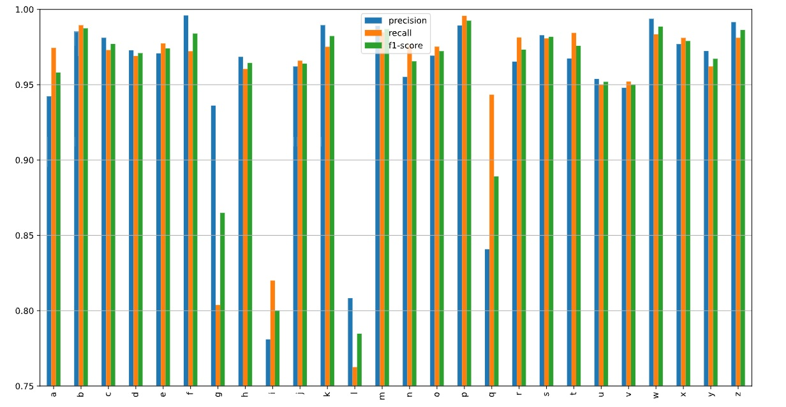
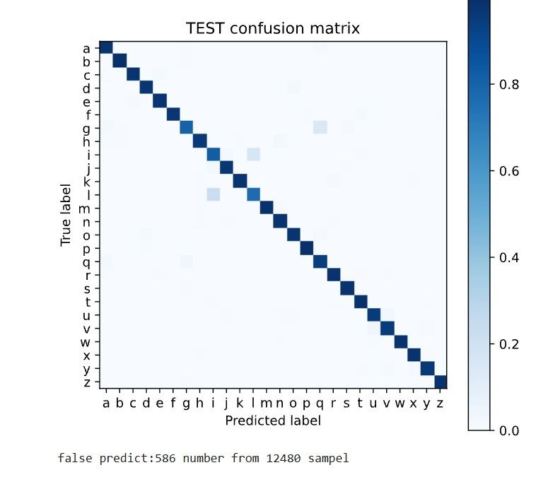

# 🔤 EMNIST Letters Classification using PyTorch CNN

> **Deep Learning • Computer Vision • PyTorch • CNN • Model Optimization • Error Analysis**

---

# ⭐ Project Highlights

- Developed a modular Convolutional Neural Network pipeline using PyTorch
- Implemented configurable CNN architecture for multi-class image classification
- Performed systematic experiments on:
  - Network architecture
  - Optimizers
  - Learning rate schedulers
  - Data augmentation techniques
- Achieved **95.30% test accuracy** on EMNIST Letters dataset
- Performed detailed model evaluation using:
  - Classification Report
  - Confusion Matrix
  - Misclassification Analysis

---

# 📌 Project Overview

This project focuses on building a handwritten character recognition system using a custom CNN architecture implemented with PyTorch.

The goal was not only to train a high-performing classifier, but also to design a reusable deep learning pipeline that supports:

- Flexible model configuration
- Training experimentation
- Optimization comparison
- Data augmentation
- Model evaluation and error analysis

The complete workflow was implemented using modular Python scripts instead of a single notebook-based approach.

---

# 📂 Dataset

## EMNIST Letters Dataset

The model was trained on the **EMNIST Letters** dataset.

Dataset characteristics:

| Property | Value |
|---|---:|
| Classes | 26 (A-Z) |
| Image Type | Grayscale |
| Image Size | 28 × 28 |
| Task | Multi-class Classification |

Dataset source:

https://www.nist.gov/itl/products-and-services/emnist-dataset

---

# 🏗 Project Structure

EMNIST/

 │  
├── README.md  
 │  
├── main.py  
├── data.py  
├── model.py  
├── train_model.py  
├── evaluate.py  
├── Architecture_Model.py  
├── augmentate.py  
 │  
├── EMNIST_CNN_Experiments.ipynb  
 │  
├── requirements.txt    
└── images/  

---

# 🔄 Deep Learning Pipeline

The project workflow:

Dataset Loading

↓

Custom PyTorch Dataset

↓

Data Augmentation

↓

CNN Model Training

↓

Optimizer & Scheduler Experiments

↓

Evaluation

↓

Error Analysis

---

# 🧠 CNN Architecture

The implemented CNN architecture consists of three convolutional blocks followed by fully connected layers.

Input  
(1 × 28 × 28)

↓

Conv2D  
BatchNorm  
LeakyReLU  
Dropout2D  
MaxPooling

↓

Conv2D  
BatchNorm  
LeakyReLU  
Dropout2D  
MaxPooling

↓

Conv2D  
BatchNorm  
LeakyReLU  
Dropout2D  
MaxPooling

↓

Flatten

↓

Fully Connected Layers

↓

Output  
(26 Classes)

---

## Final Model Configuration

The best performing configuration:

| Parameter | Value |
|---|---:|
| Conv Channels | (64,128,256) |
| Kernel Size | 7×7 |
| Padding | 3 |
| Activation | LeakyReLU |
| Batch Normalization | Yes |
| Dropout2D | 0.1 |
| Fully Connected Dropout | 0.4 |
| Hidden Units | (128,64) |
| Loss Function | CrossEntropyLoss |

---

# ⚙️ Training Configuration

| Parameter | Value |
|---|---:|
| Optimizer | AdamW |
| Weight Decay | 1e-4 |
| Scheduler | CosineAnnealingLR |
| Epochs | 10 |
| Batch Size | 64 |

---

# 🧪 Experiments & Optimization

Several experiments were performed to understand the impact of different training strategies.

| Experiment | Test Accuracy |
|---|---:|
| Baseline CNN | 93.46% |
| BatchNorm + Dropout | 94.52% |
| AdamW Optimizer | 94.50% |
| StepLR Scheduler | 94.68% |
| CosineAnnealingLR | 94.87% |
| Kernel Size = 5 | 95.06% |
| Kernel Size = 7 | 95.14% |
| OneCycleLR | 94.99% |
| RandomRotation (10°) | **95.30%** |
| RandomAffine | 95.00% |
| Rotation + RandomErasing | 94.88% |
| Affine + RandomErasing | 95.07% |

---

# 🏆 Final Model Performance

Best observed result:

Test Accuracy: 95.30%

Configuration:

CNN + BatchNorm + Dropout  
+  
AdamW  
+  
CosineAnnealingLR  
+  
RandomRotation(10°)

---

# 📊 Model Evaluation

The model was evaluated using multiple metrics and visualization techniques.

Evaluation includes:

- Classification Report
- Precision
- Recall
- F1-score
- Normalized Confusion Matrix
- Misclassified Samples Analysis

## Classification Report

## Confusion Matrix

---

# 🔍 Error Analysis

The model errors were analyzed to identify visually similar handwritten characters.

The most frequent misclassifications:

| True Class | Predicted Class | Count |
|---|---|---:|
| l | i | 101 |
| i | l | 78 |
| g | q | 70 |
| q | g | 15 |
| v | u | 15 |
| u | v | 12 |
| j | i | 10 |
| i | j | 9 |

Most errors occur between visually similar characters, which is expected for handwritten character recognition tasks.

---

# 🛠 Technologies

## Programming

- Python

## Deep Learning

- PyTorch
- TorchVision
- CNN
- Batch Normalization
- Dropout
- Learning Rate Scheduling

## Data Processing & Evaluation

- NumPy
- Pandas
- Matplotlib
- Scikit-Learn

## Development Tools

- Jupyter Notebook
- VS Code
- Git

---

# 🚀 Future Improvements

Possible improvements:

- Transfer Learning approaches
- ResNet-based architecture
- Vision Transformer (ViT)
- MixUp / CutMix augmentation
- Label Smoothing
- Early Stopping
- Mixed Precision Training
- Hyperparameter Optimization with Optuna
- Model deployment using FastAPI and Docker
- Experiment tracking using MLflow

---

# 📫 Contact

## Ziba Hatamian

GitHub:

https://github.com/zziibbaa

---

⭐ If you find this project useful, consider giving the repository a star!
