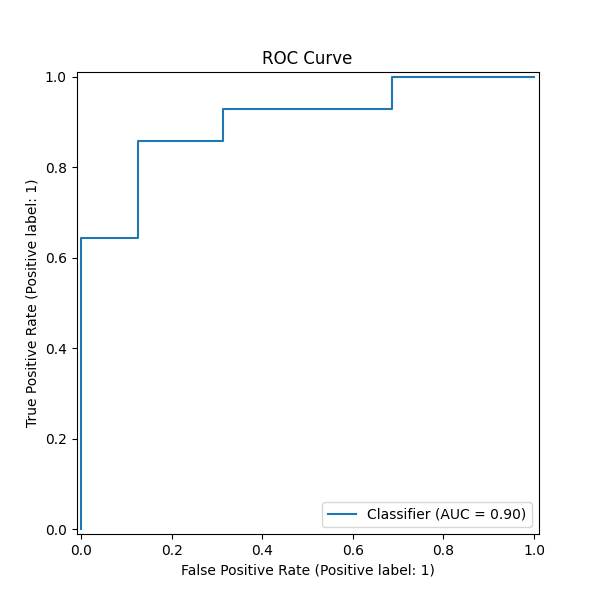
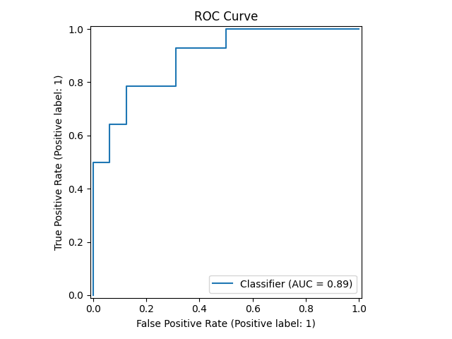
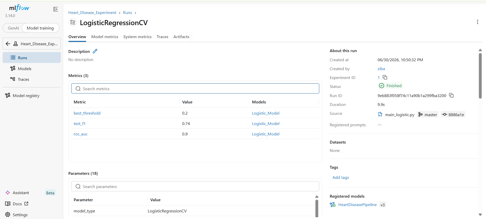
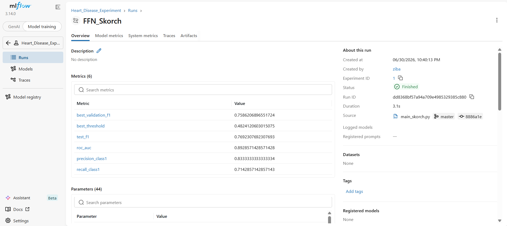

# ❤️ Heart Disease Prediction

> **End-to-End Machine Learning • Deep Learning • MLOps • Model Deployment**

An end-to-end Machine Learning project for predicting heart disease using the Cleveland Heart Disease Dataset.

This project compares a traditional Machine Learning model (**Logistic Regression**) with a **Feed Forward Neural Network (PyTorch)** and demonstrates the complete machine learning lifecycle including data preprocessing, model development, experiment tracking, REST API implementation, and Dockerized deployment.

---

# 🚀 Project Highlights

- Exploratory Data Analysis (EDA)
- Scikit-Learn preprocessing pipeline
- Logistic Regression with Cross Validation
- Feed Forward Neural Network (PyTorch)
- Validation-based threshold optimization
- MLflow experiment tracking
- FastAPI REST API development
- Dockerized deployment
- End-to-End Machine Learning workflow

---

# 🔄 Project Workflow

```text
                Cleveland Dataset
                       │
                       ▼
               Data Cleaning & EDA
                       │
                       ▼
         Train / Validation / Test Split
                       │
                       ▼
          Scikit-Learn Preprocessing Pipeline
      (StandardScaler + OneHotEncoder)
                       │
          ┌────────────┴────────────┐
          │                         │
          ▼                         ▼
 Logistic Regression         Feed Forward Network
          │                         │
          └────────────┬────────────┘
                       ▼
            Threshold Optimization
         (Validation F1-Score Search)
                       │
                       ▼
               Model Evaluation
                       │
                       ▼
                MLflow Tracking
                       │
                       ▼
                FastAPI REST API
                       │
                       ▼
                    Docker
```

---

# 📊 Dataset

### Cleveland Heart Disease Dataset

The dataset contains clinical measurements commonly used for heart disease diagnosis.

### Features

- Age
- Sex
- Chest Pain Type
- Resting Blood Pressure
- Cholesterol
- Fasting Blood Sugar
- Resting ECG
- Maximum Heart Rate
- Exercise-Induced Angina
- Oldpeak
- Slope
- Number of Major Vessels (ca)
- Thalassemia (thal)

### Target

| Value | Description |
|------|-------------|
| 0 | No Heart Disease |
| 1 | Heart Disease |

---

# ⚙️ Data Preprocessing

The preprocessing pipeline includes:

- Missing value removal
- Stratified Train / Validation / Test split
- Standardization of numerical features
- One-Hot Encoding of categorical variables
- Validation-based threshold optimization

A Scikit-Learn Pipeline guarantees identical preprocessing during both training and inference.

---

# 🤖 Models

## Logistic Regression

Implemented using:

- LogisticRegressionCV
- 10-fold Cross Validation
- Automatic regularization parameter selection
- Validation threshold optimization

---

## Feed Forward Neural Network (PyTorch)

### Architecture

```text
Input
   │
Linear → 32
   │
LeakyReLU
   │
Dropout(0.3)
   │
Linear → 16
   │
LeakyReLU
   │
Dropout(0.3)
   │
Linear → 2
```

### Training Strategy

- CrossEntropyLoss
- Adam Optimizer
- Validation-based model selection
- Best model selected using Validation Accuracy

---

# 📈 Model Performance

| Model | Accuracy | Precision | Recall | F1-score | ROC-AUC |
|-------|---------:|----------:|-------:|---------:|--------:|
| Logistic Regression | 0.70 | 0.62 | **0.93** | 0.74 | **0.90** |
| Feed Forward Network | **0.80** | **0.83** | 0.71 | **0.77** | 0.89 |

---

# 📌 Key Findings

- Logistic Regression achieved the highest Recall, making it particularly useful when minimizing false negatives is important.
- The Feed Forward Neural Network achieved the best balance between Precision and F1-score.
- Logistic Regression remains a competitive baseline model for relatively small structured clinical datasets.
- Threshold optimization significantly improved classification performance by balancing Precision and Recall.

---

# 📉 ROC Curve

| Logistic Regression | Feed Forward Network |
|:------------------:|:------------------:|
|  |  |

---

# 📊 Experiment Tracking

Model experiments were tracked using **MLflow**.

Logged information includes:

- Hyperparameters
- Validation metrics
- Test metrics
- Best threshold
- ROC-AUC scores
- Saved model artifacts

### Logistic Regression

<p align="center">

</p>

### Feed Forward Network

<p align="center">

</p>

---

# 🚀 REST API

The trained PyTorch model is deployed using **FastAPI**.

## Available Endpoints

| Endpoint | Description |
|---------|-------------|
| `/health` | Health Check |
| `/predict` | Heart Disease Prediction |

### Example Request

```json
{
    "age":63,
    "sex":1,
    "cp":1,
    "trestbps":145,
    "chol":233,
    "fbs":1,
    "restecg":2,
    "thalach":150,
    "exang":0,
    "oldpeak":2.3,
    "slope":3,
    "thal":6,
    "ca":0
}
```

### Example Response

```json
{
    "prediction":1,
    "probability":0.759,
    "threshold":0.482,
    "result":"Heart Disease"
}
```

---

# 🐳 Docker

Build the Docker image:

```bash
docker build -t heart-disease-api .
```

Run the container:

```bash
docker run -p 8000:8000 heart-disease-api
```

Swagger UI:

```text
http://localhost:8000/docs
```

---

# 📂 Project Structure

```text
Heart_Disease/
│
├── data/
├── notebooks/
├── images/
├── Logistic_Regression/
├── FFN_Pipeline_v2/
├── mlruns/
└── README.md
```

---

# 🛠 Technologies

- Python
- NumPy
- Pandas
- Matplotlib
- Scikit-Learn
- PyTorch
- FastAPI
- MLflow
- Docker
- Joblib

---

# 🚀 Installation

Clone the repository:

```bash
git clone https://github.com/zziibbaa/ML_Portfolio.git
```

Move to the project directory:

```bash
cd ML_Portfolio/Machine_Learning/Heart_Disease_Prediction
```

Install dependencies:

```bash
pip install -r FFN_Pipeline_v2/requirements.txt
```

Run the Logistic Regression model:

```bash
python Logistic_Regression/main_logistic.py
```

Run the Feed Forward Neural Network:

```bash
python FFN_Pipeline_v2/main_skorch.py
```

---

# 👩‍💻 Author

### Ziba Hatamian

Junior Machine Learning Engineer

#### Areas of Interest

- Machine Learning
- Deep Learning
- MLOps
- Model Deployment
- AI for Healthcare

#### GitHub

```text
https://github.com/zziibbaa
```

---

⭐ If you find this project useful, consider giving the repository a star.
