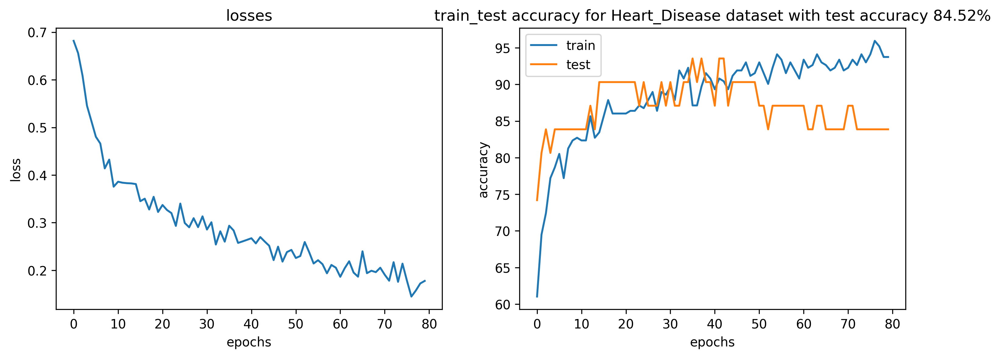
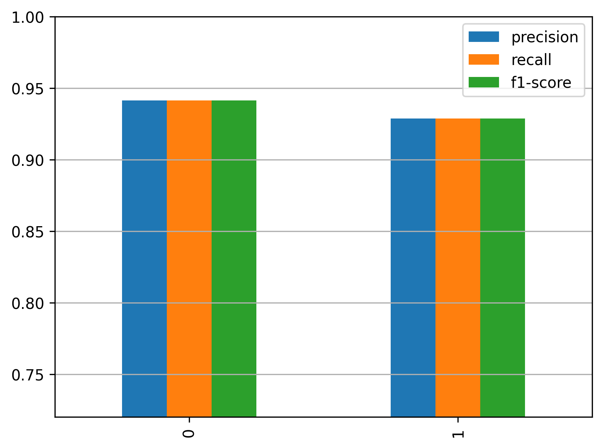

# ❤️ Heart Disease Prediction

A Machine Learning and Deep Learning project for predicting heart disease using the UCI Heart Disease dataset.

---

## 📌 Project Overview

The goal of this project is to predict whether a patient has heart disease based on clinical features.

Two different approaches were implemented and compared:

1. Logistic Regression
2. Feed Forward Neural Network (FFN) using PyTorch

The project includes:

- Data preprocessing
- Feature scaling
- One-Hot Encoding
- Model training
- Threshold optimization using Validation F1-score
- Performance evaluation
- ROC Curve
- Confusion Matrix
- Classification Report

---

## 📊 Dataset

**Heart Disease Dataset**

Target variable:

```text
DISEASE
```

Converted into a binary classification problem:

```python
data["DISEASE"] = (data["DISEASE"] > 0).astype(int)
```

| Value | Meaning |
|---------|---------|
| 0 | No Heart Disease |
| 1 | Heart Disease |

---

## ⚙️ Data Preprocessing

### Numerical Features

```text
age
trestbps
chol
thalach
oldpeak
```

Scaled using:

```python
StandardScaler()
```

### Categorical Features

```text
sex
cp
fbs
restecg
exang
slope
thal
ca
```

Encoded using:

```python
OneHotEncoder(drop='first')
```

---

## 🔀 Train / Validation / Test Split

```text
Train      : 80%
Validation : 10%
Test       : 10%
```

Stratified sampling was used to preserve class distribution.

---

# 🤖 Model 1: Logistic Regression

Implemented using:

```python
LogisticRegressionCV()
```

### Hyperparameter Selection

Cross-validation:

```python
cv=10
```

### Threshold Optimization

Instead of using the default threshold:

```text
0.50
```

The optimal threshold was selected on the validation set by maximizing the F1-score.

---

## 📈 Logistic Regression Results

### Best Threshold

```text
0.467
```

### Test Results

| Metric | Score |
|----------|----------|
| Accuracy | 0.94 |
| Precision | 0.93 |
| Recall | 0.93 |
| F1-score | 0.93 |

### Classification Report

```text
              precision    recall  f1-score

Class 0         0.94       0.94      0.94
Class 1         0.93       0.93      0.93
```

---

# 🧠 Model 2: Feed Forward Neural Network (PyTorch)

### Architecture

```text
Input Layer
     ↓
Linear(input_dim → 32)
     ↓
LeakyReLU
     ↓
Dropout(0.3)
     ↓
Linear(32 → 16)
     ↓
LeakyReLU
     ↓
Dropout(0.3)
     ↓
Linear(16 → 2)
```

### Loss Function

```python
CrossEntropyLoss()
```

### Optimizer

```python
Adam(lr=0.001)
```

---

## 📈 FFN Results

### Test Results

| Metric | Score |
|----------|----------|
| Accuracy | 0.90 |
| Precision | 0.82 |
| Recall | 1.00 |
| F1-score | 0.90 |

### Classification Report

```text
              precision    recall  f1-score

Class 0         1.00       0.82      0.90
Class 1         0.82       1.00      0.90
```

---

# 📊 Model Comparison

| Metric | Logistic Regression | FFN |
|----------|----------|----------|
| Accuracy | **0.94** | 0.90 |
| Precision | **0.93** | 0.82 |
| Recall | 0.93 | **1.00** |
| F1-score | **0.93** | 0.90 |

---

## 📝 Conclusion

For this dataset, **Logistic Regression outperformed the Feed Forward Neural Network**.

Possible reasons:

- Small dataset size
- Limited feature complexity
- Linear decision boundary is sufficient

This project demonstrates that simpler machine learning models can outperform deep learning models on structured tabular datasets.

---

## 📁 Project Structure

```text
Heart_Disease/
│
├── data_loader.py
├── preprocessing.py
│
├── Logistic_Regression/
│   ├── training.py
│   ├── evaluation.py
│   └── main_logistic.py
│
├── FFN_Model/
│   ├── build_model.py
│   ├── training.py
│   ├── evaluation.py
│   └── main.py
│
├── best_model.pth
├── loss_accuracy.png
├── classification_metrics.png
│
└── README.md
```

---

## 🛠 Technologies Used

- Python
- NumPy
- Pandas
- Matplotlib
- Scikit-Learn
- PyTorch

---

## 🎯 Key Learning Outcomes

- Building end-to-end Machine Learning pipelines
- Handling healthcare tabular datasets
- Threshold optimization using F1-score
- Comparing classical ML and Deep Learning models
- Evaluating classification models with multiple metrics
- Implementing Feed Forward Neural Networks in PyTorch

---

## 👩‍💻 Author

**Ziba**

Machine Learning & AI Portfolio Project

---

### Personal Note

As someone with a background in Genetics and Biotechnology transitioning into AI and Data Science, I built this project to strengthen my understanding of classification workflows, model evaluation, and the practical trade-offs between traditional machine learning and deep learning approaches on real-world healthcare datasets.


## Results
### ROC Curve
### Logistic Regression ROC Curve


The ROC curve of the Logistic Regression model.

### FFN ROC Curve


The ROC curve of the Feed Forward Neural Network (FFN) model.

### Training Curves



### Classification Metrics



