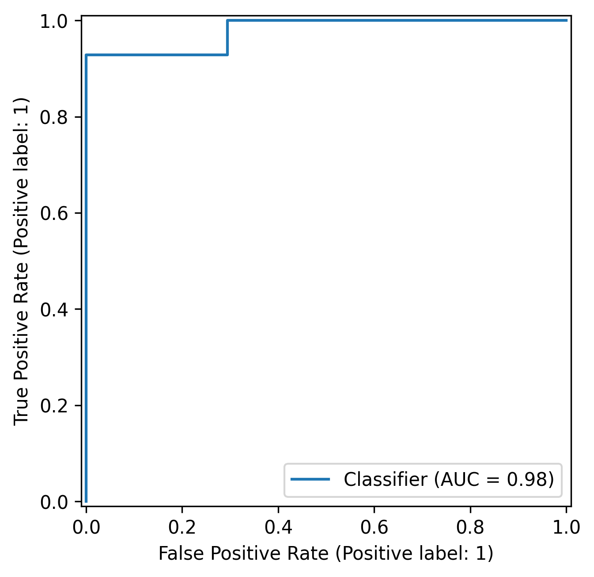
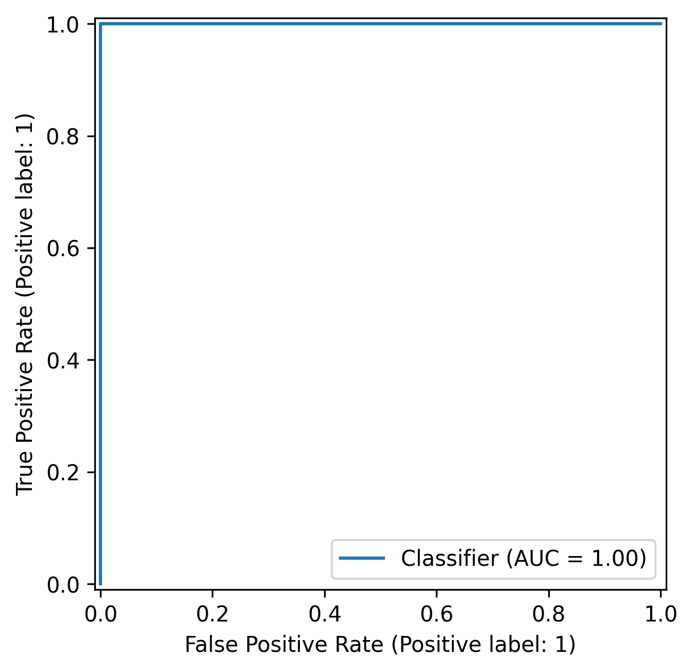

# ❤️ Heart Disease Prediction

A Machine Learning project for predicting the presence of heart disease using clinical patient data. This project compares the performance of a traditional Machine Learning model (**Logistic Regression**) with a Deep Learning model (**Feed Forward Neural Network - FFN**).

---

## 📌 Project Overview

The goal of this project is to build and evaluate classification models that can predict whether a patient has heart disease based on medical attributes such as age, cholesterol level, chest pain type, and other clinical measurements.

Two models were implemented and compared:

- Feed Forward Neural Network (PyTorch)
- Logistic Regression

---

## 📊 Dataset

**Heart Disease Dataset (Cleveland)**

Features include:

- Age
- Sex
- Chest Pain Type
- Resting Blood Pressure
- Cholesterol
- Fasting Blood Sugar
- Resting ECG
- Maximum Heart Rate
- Exercise Induced Angina
- ST Depression (Oldpeak)
- Slope
- Number of Major Vessels (ca)
- Thalassemia (thal)

Target:

- `0` → No Heart Disease
- `1` → Heart Disease

---

## ⚙️ Data Preprocessing

- Train / Validation / Test split
- Stratified sampling
- Standardization of numerical features
- One-Hot Encoding of categorical features
- Threshold optimization based on Validation F1-Score

---

## 🤖 Models


### Feed Forward Neural Network (FFN)

Architecture:

```text
Input Layer
     ↓
Linear(Features → 32)
     ↓
LeakyReLU
     ↓
Dropout(0.3)
     ↓
Linear(32 → 16)
     ↓
LeakyReLU
     ↓
Dropout(0.3)
     ↓
Linear(16 → 2)
```

Training:

- Loss Function: CrossEntropyLoss
- Optimizer: Adam
- Early model selection based on Validation Accuracy

---

### Logistic Regression

- LogisticRegressionCV
- Cross-validation for hyperparameter selection
- Threshold tuning using Validation F1-score


## 📈 Results

| Model | Accuracy | Precision | Recall | F1-Score | ROC-AUC |
|---------|---------|---------|---------|---------|---------|
| FFN | 0.90 | 0.91 | 0.91 | 0.90 | 1.00 |
| Logistic Regression | 0.94 | 0.93 | 0.93 | 0.93 | 0.98 |


# 🚀 REST API

The PyTorch model is deployed using **FastAPI**.

Available endpoints:

| Endpoint | Description |
|----------|-------------|
| `/health` | Health check |
| `/predict` | Predict heart disease |

Example Response

```json
{
    "prediction": 1,
    "probability": 0.759,
    "threshold": 0.432,
    "result": "Heart Disease"
}
```

---

# 🐳 Docker

Build Docker image

```bash
docker build -t heart-disease-api .
```

Run container

```bash
docker run -p 8000:8000 heart-disease-api
```

Swagger UI

```
http://localhost:8000/docs
```

---

### Key Observation

- FFN achieved a perfect ROC-AUC score on the test split but slightly lower F1-score.
- Logistic Regression achieved the highest F1-score and overall classification performance.
- For this dataset size, Logistic Regression performed competitively against the neural network while requiring significantly less complexity.

---

## 📉 ROC Curve Comparison

<table>
<tr>
<th align="center">Logistic Regression</th>
<th align="center">Feed Forward Neural Network (FFN)</th>
</tr>

<tr>
<td align="center">

</td>

<td align="center">

</td>
</tr>
</table>

---

## 📂 Project Structure


```text
Heart_Disease/
│
├── data/
│   └── processed.cleveland.data
│
├── images/
│   ├── classification_metrics_FFN.png
│   ├── loss_accuracy_FFN.png
│   ├── RocCurveDisplay_FFN.png
│   └── RocCurveDisplay_logistic.png
│
├── notebooks/
│   ├── Heart Disease Dataset__EDA.ipynb
│   └── Display Result of Logistic Regression.ipynb
│
├── Logistic_Regression/
│   ├── data_loader.py
│   ├── preprocessing.py
│   ├── training_logistic.py
│   ├── evaluation_logistic.py
│   ├── main_logistic.py
│   ├── best_logistic_model.pkl
│   ├── preprocessor.pkl
│   └── requirements.txt
│
└── FFN_Model/
    ├── api.py
    ├── build_model.py
    ├── preprocessing.py
    ├── training.py
    ├── evaluation.py
    ├── main.py
    ├── best_model.pt
    ├── preprocessor.pkl
    ├── threshold.pkl
    ├── Dockerfile
    ├── requirements.txt
    └── data_loader.py
```

---

## 🚀 Installation

Clone the repository:

```bash
git clone https://github.com/zziibbaa/ML_Portfolio.git
```

Move to the project directory:

```bash
cd ML_Portfolio/Machine_Learning_Project/Heart_Disease
```

Install dependencies:

```bash
pip install -r requirements.txt
```

---

## 🛠 Technologies Used

- Python
- Pandas
- NumPy
- Matplotlib
- Scikit-Learn
- PyTorch
- FastAPI
- Docker
- Joblib

---

## 👩‍💻 Author

**Ziba**

- MSc in Biotechnology
- Machine Learning & Deep Learning Enthusiast
- Interested in AI applications in healthcare

GitHub:
https://github.com/zziibbaa

---
