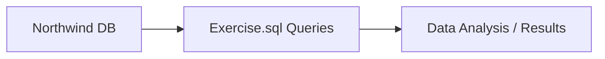

# Machine Learning & SQL Portfolio – MyProject

مجموعه‌ای از پروژه‌های یادگیری ماشین و SQL با تمرکز بر تحلیل داده، مدل‌سازی، خوشه‌بندی، طبقه‌بندی متون و دیپلوی مدل‌ها.  
هر پروژه با ابزارهای مدرن مانند Scikit-learn، FastAPI، Flask، Plotly، Docker و SQL پیاده‌سازی شده است.

---

## 🗂 فهرست پروژه‌ها

- [🔍 تحلیل اکتشافی داده‌ها (EDA)](#-تحلیل-اکتشافی-داده‌ها-eda)
- [📊 مدل‌سازی و پیش‌بینی](#-مدل‌سازی-و-پیش‌بینی)
- [💬 طبقه‌بندی متون (NLP)](#-طبقه‌بندی-متون-nlp)
- [🌀 خوشه‌بندی داده‌ها](#-خوشه‌بندی-داده‌ها)
- [🚀 دیپلوی مدل‌ها (API)](#-دیپلوی-مدل‌ها-api)
- [🏢 پروژه SQL – Northwind](#-پروژه-sql--northwind)
- [⚙️ تکنولوژی‌های استفاده شده](#️-تکنولوژی‌های-استفاده-شده)
- [📄 مجوز](#-مجوز)
- [🙋‍♀️ درباره من](#-درباره-من)

---

## 🔍 تحلیل اکتشافی داده‌ها (EDA)

| عنوان پروژه | توضیح | منبع |
|-------------|-------|-------|
| 🎬 Fandango Ratings | بررسی دستکاری امتیازات فیلم‌ها توسط Fandango | [FiveThirtyEight](http://fivethirtyeight.com/features/fandango-movies-ratings) |
| 🌧 Rainfall in India | تحلیل روند بارندگی در هند | [CleverProgrammer](https://thecleverprogrammer.com/2024/11/18/rainfall-trends-in-india-analysis-with-python/) |
| 🎞 Netflix Strategy | تحلیل محتوای نتفلیکس با Plotly و آمار توصیفی | [CleverProgrammer](https://thecleverprogrammer.com/2024/09/30/netflix-content-strategy-analysis-with-python/) |

---

## 📊 مدل‌سازی و پیش‌بینی

| عنوان پروژه | الگوریتم‌ها | تکنیک‌ها | منبع |
|-------------|-------------|----------|-------|
| 🏠 Ames Housing | Elastic Net | Imputation, Outlier Handling, GridSearchCV | [Kaggle](https://www.kaggle.com/datasets/shashanknecrothapa/ames-housing-dataset/data) |
| ❤️ Heart Disease | Logistic Regression | مدل‌سازی و ارزیابی با متریک‌های مختلف | [UCI Dataset](https://archive.ics.uci.edu/ml/datasets/Heart+Disease) |
| 🧬 Gene Expression | KNN | Pipeline، GridSearch | [ScienceDirect](https://www.sciencedirect.com/topics/biochemistry-genetics-and-molecular-biology/gene-expression-level) |
| 🪨 Rock Density | RandomForest vs سایر رگرسیون‌ها | مقایسه مدل‌ها با متریک‌های ارزیابی | [Kaggle](https://www.kaggle.com/code/abirchodha/rock-density-regression-various-models) |

---

## 💬 طبقه‌بندی متون (NLP)

| عنوان پروژه | الگوریتم‌ها | تکنیک‌ها | منبع |
|-------------|-------------|----------|--------|
| 🎭 IMDB Reviews | MultinomialNB | Cleaning، Tokenization | [Stanford AI Lab](http://ai.stanford.edu/~amaas/data/sentiment) |
| ✈ Twitter Airline | MNB vs Logistic vs SVC | مقایسه مدل‌ها، ارزیابی عملکرد | [Kaggle](https://www.kaggle.com/crowdflower/twitter-airline-sentiment?select=Tweets.csv) |

---

## 🌀 خوشه‌بندی داده‌ها

| عنوان پروژه | الگوریتم | تکنیک‌ها | منبع |
|-------------|-----------|-----------|-------|
| 🏦 Bank Marketing | KMeans | تعیین K بهینه با Elbow | [UCI Dataset](https://archive.ics.uci.edu/ml/datasets/bank+marketing) |
| 🌍 World Factbook | KMeans | پیش‌پردازش، مقایسه کشورها | [CIA World Factbook](https://www.cia.gov/library/publications/the-world-factbook/docs/faqs.html) |
| 🛒 Wholesale Customers | DBSCAN | یافتن eps بهینه | [UCI Dataset](https://archive.ics.uci.edu/ml/datasets/Wholesale+customers) |

---

## 🚀 دیپلوی مدل‌ها (API)

📁 مسیر پروژه: `MyProject/05_Deployment/`

### Flowchart – Deployment Pipeline

```mermaid
flowchart TD
    A[Training Script] --> B[MLflow Tracking]
    B --> C[Saved Model (.pkl)]
    C --> D[FastAPI Prediction API]
    D --> E[Docker Container]
    E --> F[Client Requests / Swagger UI]
```

### ویژگی‌ها:

- RESTful API با FastAPI و Flask  
- مستندسازی خودکار با Swagger (FastAPI)  
- پیش‌پردازش داده و پیش‌بینی با Pipeline  
- تست‌پذیر با pytest  
- اجرای سریع با Docker

---

## 🏢 پروژه SQL – Northwind

این پروژه شامل **۳۰ تمرین SQL** بر اساس دیتابیس **Northwind** است و هدف آن تمرین مفاهیم SQL پایه و پیشرفته و تحلیل داده‌ها با استفاده از جداول واقعی کسب‌وکار می‌باشد.

### Flowchart – SQL Project



### 🗂️ ساختار پروژه
```
SQL_Project/
├── NorthWind_Project/
│   ├── Exercise.sql
│   └── README.md
└── Northwind/
```

### تمرین‌ها و اهداف آن‌ها
- نمایش اطلاعات مشتریان و سفارش‌ها  
- محاسبات آماری و تجمیعی (sum, avg, count)  
- فیلتر بر اساس شرط‌ها و گروه‌بندی داده‌ها  
- ارتباط جداول با JOIN  
- تحلیل محصولات و فروش  

### نحوه اجرای پروژه
```bash
git clone --recurse-submodules https://github.com/zziibbaa/SQL_Project.git
git submodule update --init --recursive
```

---

## ⚙️ تکنولوژی‌های استفاده شده

| دسته‌بندی | ابزار / فریم‌ورک |
|-----------|-------------------|
| برنامه‌نویسی | Python, SQL |
| تحلیل داده | Pandas, NumPy |
| مدل‌سازی | Scikit-learn |
| مصورسازی | Matplotlib, Seaborn, Plotly |
| NLP | NLTK |
| API | FastAPI, Flask |
| دیپلوی | Docker |
| تست | Pytest |
| مدیریت پروژه | Git, GitHub |

---

## 📄 مجوز

این پروژه تحت مجوز **MIT** منتشر شده و استفاده غیرتجاری با ذکر منبع آزاد است.

---

## 🙋‍♀️ درباره من

من فارغ‌التحصیل **بیوتکنولوژی** با علاقه و تخصص در **یادگیری ماشین، تحلیل داده‌ها و توسعه APIهای هوشمند** هستم.  
برای همکاری، بازخورد یا پیشنهاد شغلی، خوشحال می‌شوم از طریق گیت‌هاب در تماس باشید:

📎 [GitHub Profile](https://github.com/zziibbaa)
